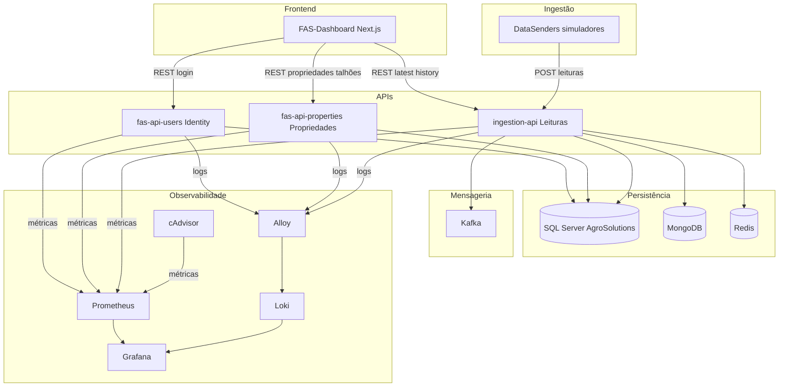
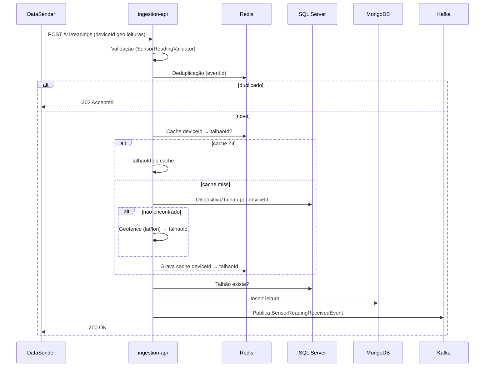

# Desenho da Solução MVP — FAS / AgroSolutions

Este documento descreve a arquitetura da solução MVP do projeto FAS (Fazenda AgroSolutions): diagrama da arquitetura, justificativa técnica das decisões e atendimento aos requisitos não funcionais. A stack está documentada em [README.md](README.md) e [DEMONSTRACAO.md](DEMONSTRACAO.md).

---

## 1. Diagrama da arquitetura da solução

### 1.1 Visão de deployment (alto nível)

O diagrama abaixo representa os componentes da solução e os fluxos principais entre eles.

- **Frontend:** FAS-Dashboard (Next.js) consome as três APIs (login/Identity, propriedades/talhões, leituras).
- **APIs:** fas-api-users (Identity/JWT), fas-api-properties (propriedades e talhões), ingestion-api (ingestão e consulta de leituras).
- **DataSenders:** simuladores que enviam leituras de sensores para a ingestion-api.
- **Persistência:** SQL Server (database AgroSolutions para usuários e propriedades), MongoDB (leituras de sensores), Redis (cache device→talhão e deduplicação).
- **Mensageria:** Kafka (eventos de leitura recebida para processamento assíncrono).
- **Observabilidade:** Prometheus (métricas das APIs e cAdvisor), Grafana (dashboards), Loki (logs), Alloy (coleta de logs dos containers).

### 1.2 Fluxo de dados: leitura de sensor

Fluxo simplificado desde o envio da leitura pelo simulador até a persistência e publicação do evento.

- **Validação:** payload validado (deviceId, timestamp, geo, leituras).
- **Deduplicação:** Redis evita processar o mesmo evento duas vezes.
- **Resolução do talhão:** Redis (cache) → SQL (dispositivo/talhão) → geofence se necessário; resultado cacado.
- **Persistência:** leitura gravada no MongoDB; evento publicado no Kafka para consumidores assíncronos.

---

## 2. Justificativa técnica das decisões arquiteturais

| Decisão | Justificativa técnica |
|--------|------------------------|
| **Microsserviços em .NET 8** | Consistência de stack, desempenho e deploy independente por domínio (Identity, Propriedades, Ingestão). Estrutura em camadas (API, Application, Domain, Infra) em cada serviço. |
| **Um único database SQL (AgroSolutions)** para FAS-Usuarios e FAS-Propriedades | Reduz operação (um backup, um ponto de restauração); as duas APIs compartilham contexto transacional quando necessário; migrations aplicadas por projeto. Configuração em [docker-compose.yml](docker-compose.yml). |
| **MongoDB para leituras de sensores** | Alto volume de escritas, modelo flexível (documentos por leitura/agregação), consultas por talhão e hora (latest, history 24h) atendidas pela ingestion-api. |
| **Redis** | Cache deviceId → talhaoId reduz carga no SQL; deduplicação de eventos por chave para evitar reprocessamento. |
| **Kafka** | Desacoplamento: publicação de eventos de leitura para processamento assíncrono e futuros consumidores (regras de alerta, analytics). Tópico `agrosolutions.sensor.readings.received.v1`. |
| **API Key na ingestion-api** | Proteção do endpoint público de ingestão (sensores/IoT) sem exigir JWT por dispositivo. Middleware em [FAS-DataReceiver/Api/Middleware/ApiKeyMiddleware.cs](FAS-DataReceiver/Api/Middleware/ApiKeyMiddleware.cs). |
| **JWT nas APIs de negócio (Users, Propriedades)** | Identidade e autorização por ProducerId para acesso a dados do produtor; integração com o FAS-Dashboard. |
| **Observabilidade: Prometheus + Grafana + Loki + Alloy + cAdvisor** | Métricas das APIs e containers (Prometheus/cAdvisor), visualização (Grafana), logs centralizados (Loki) com coleta via Alloy; atende requisito de monitoramento. Configuração em [monitoring/](monitoring/). |
| **Testes unitários obrigatórios antes do deploy local** | Garantia de qualidade e regressão; scripts [run-tests.ps1](run-tests.ps1) e [run-tests.sh](run-tests.sh); pipeline CI executa os mesmos testes. |
| **CI/CD (GitHub Actions) + manifestos K8s** | Build, testes, lint e validação de manifests; preparação para deploy em Kubernetes. Workflow em [.github/workflows/ci-cd.yml](.github/workflows/ci-cd.yml), manifestos em [k8s/](k8s/). |

---

## 3. Requisitos não funcionais

Descrição de como a solução atual atende os requisitos não funcionais típicos de um MVP.

### Disponibilidade e resiliência

- **Docker Compose:** healthchecks (ex.: SQL Server) e `depends_on` com condition garantem ordem de subida e detecção de falha.
- **Kubernetes:** manifestos em [k8s/](k8s/) permitem readiness/liveness e múltiplas réplicas para aumentar disponibilidade em produção.

### Escalabilidade

- **APIs stateless:** fas-api-users, fas-api-properties e ingestion-api podem ser replicadas horizontalmente.
- **Redis e Kafka** permitem escalar a ingestão; MongoDB e Kafka são escaláveis horizontalmente.
- **K8s:** HPA (Horizontal Pod Autoscaler) pode ser aplicado conforme [DEMONSTRACAO.md](DEMONSTRACAO.md) para FAS-Usuarios e FAS-Propriedades.

### Segurança

- **Ingestion-api:** proteção por API Key (header ou query); senhas e secrets via variáveis de ambiente, não commitados.
- **APIs de negócio:** autenticação JWT e autorização por ProducerId.
- **Produção:** uso de HTTPS, secrets em Kubernetes ou vault e boas práticas de hardening.

### Observabilidade

- **Métricas:** Prometheus faz scrape de `/metrics` das três APIs e do cAdvisor; dashboards no Grafana (Containers, métricas das APIs).
- **Logs:** Alloy coleta logs dos containers e envia ao Loki; consultas no Grafana (datasource Loki, dashboard "Logs (Loki)").
- **Evolução:** rastreamento distribuído (ex.: OpenTelemetry) pode ser adicionado para correlacionar requisições entre serviços.

### Desempenho

- **Cache Redis** na resolução deviceId → talhaoId reduz acessos ao SQL.
- **Ingestão:** validação e persistência otimizadas; publicação em Kafka permite processamento assíncrono.
- **Consultas:** endpoints latest e history da ingestion-api utilizam consultas e agregações otimizadas no MongoDB.

### Manutenibilidade e qualidade

- **Testes unitários** nos projetos FAS-Usuarios, FAS-Propriedades e FAS-DataReceiver; obrigatórios antes do deploy local ([run-tests.ps1](run-tests.ps1), [run-tests.sh](run-tests.sh)).
- **Pipeline CI:** testes, lint (FAS-Dashboard) e validação dos manifestos K8s em cada push ([.github/workflows/ci-cd.yml](.github/workflows/ci-cd.yml)).
- **Documentação:** README, DEMONSTRACAO, Swagger nas APIs e este documento.
- **Estrutura em camadas** (API, Application, Domain, Infra) facilita evolução e testes.
