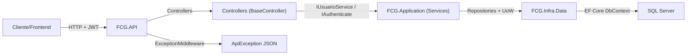
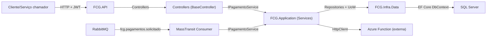
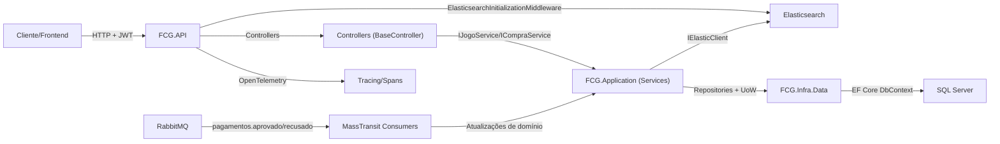

# 01.1 — Diagramas (Mermaid) — FGC

Os diagramas abaixo representam o fluxo **request → controller → application → infra → persistência/integrações**, conforme implementado nos projetos FGC.

## FCG - Usuarios

## FCG - Pagamentos

## FCG - Jogos

