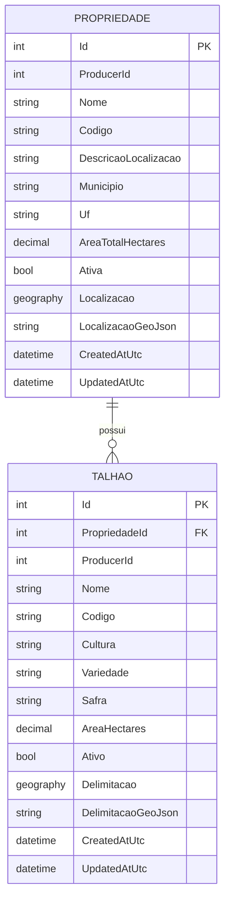

# 03 — Modelagem (Propriedade + Talhões) com GeoJSON

## Objetivo

Implementar **Cadastro de Propriedade** e **Cadastro de Talhões** (roadmap US-003/US-004) com:

- Modelagem consistente com a assinatura FGC/FAS (camadas, EF Core, notifications).
- Suporte a **GeoJSON** no contrato HTTP e uma estratégia de armazenamento coerente com o banco padrão (SQL Server).
- Regras de **ownership** por produtor (claim `ProducerId` no JWT).

## Opções de modelagem

### Opção A — Simples (consistente e “mínimo viável”)

**Armazenamento**
- `GeoJson` como `nvarchar(max)` (texto).

**Prós**
- Funciona bem em SQLite (dev) e SQL Server.
- Baixa complexidade de infra (sem tipos espaciais).

**Contras**
- Sem suporte real a consultas geoespaciais (raio, interseção, etc.).
- Sem índices espaciais.
- Cálculos (área/perímetro/validade topológica) ficam 100% na aplicação.

### Opção B — Robusta (futura e “geo-first”) — **Escolhida**

**Armazenamento**
- Coluna espacial no SQL Server (`geography`) mapeada via **NetTopologySuite** (EF Core).
- Coluna adicional `GeoJson` (texto) opcional para:
  - Debug/auditoria de payload
  - Re-export fiel do GeoJSON recebido

**Prós**
- Habilita futuro com consultas geoespaciais e índices espaciais.
- Área/perímetro podem ser calculados com alta fidelidade no banco (`geography`).
- Continua suportando dev com SQLite via conversão para texto (sem spatial queries).

**Contras**
- Exige configuração adicional (NetTopologySuite + mapeamento EF).
- Em SQLite dev, **não há suporte a SpatiaLite por padrão**: persistimos GeoJSON em texto e não criamos colunas espaciais.

## Modelo escolhido (Opção B)

### Entidades

#### Propriedade

- `Id` (int, PK)
- `ProducerId` (int) — dono (do JWT)
- `Nome` (string)
- `Codigo` (string, opcional) — identificador curto (ex.: “FAZ-001”)
- `DescricaoLocalizacao` (string, opcional)
- `Municipio` (string, opcional)
- `Uf` (string, opcional, 2 letras)
- `AreaTotalHectares` (decimal, opcional) — área total informada
- `Ativa` (bool) — flag de ativação
- `Localizacao` (Geometry, opcional) — `Point|Polygon|MultiPolygon` em SRID 4326
- `LocalizacaoGeoJson` (string, opcional) — cópia do GeoJSON recebido (opcional)
- `CreatedAtUtc` (datetime)
- `UpdatedAtUtc` (datetime, opcional)

#### Talhão

- `Id` (int, PK)
- `PropriedadeId` (int, FK → Propriedade)
- `ProducerId` (int) — redundante por performance/segurança (valida com Propriedade)
- `Nome` (string)
- `Codigo` (string, opcional) — identificador curto (ex.: “T-01”)
- `Cultura` (string)
- `Variedade` (string, opcional)
- `Safra` (string, opcional) — ex.: “2025/2026”
- `AreaHectares` (decimal, opcional) — área informada
- `Ativo` (bool) — flag de ativação
- `Delimitacao` (Geometry) — **Polygon|MultiPolygon**, SRID 4326
- `DelimitacaoGeoJson` (string, opcional)
- `CreatedAtUtc` (datetime)
- `UpdatedAtUtc` (datetime, opcional)

### ERD (conceitual)



### Índices/constraints recomendados

- `PROPRIEDADE`: índice em `(ProducerId)` e opcional unique `(ProducerId, Nome)`.
- `TALHAO`: índice em `(PropriedadeId)` e opcional unique `(PropriedadeId, Nome)`.
- Spatial index (SQL Server) nas colunas `geography` (futuro; pode ser adicionado via migration SQL).

## Geo (decisões técnicas obrigatórias)

### SRID e padrão

- SRID padrão: **EPSG:4326**.
- GeoJSON assume ordem **[longitude, latitude]**.

### Formato aceito no contrato HTTP

- Aceitamos **GeoJSON Geometry** (não `Feature`), por exemplo:

**Talhão (Polygon)**
```json
{
  "type": "Polygon",
  "coordinates": [
    [
      [-46.6320, -23.5505],
      [-46.6310, -23.5505],
      [-46.6310, -23.5495],
      [-46.6320, -23.5495],
      [-46.6320, -23.5505]
    ]
  ]
}
```

**Propriedade (Point)**
```json
{
  "type": "Point",
  "coordinates": [-46.6333, -23.5500]
}
```

### Regras de validação GeoJSON

- JSON deve ser parseável como GeoJSON geometry.
- Para `Talhão.Delimitacao`:
  - `type` deve ser `Polygon` ou `MultiPolygon`.
  - Anel externo deve ser fechado (primeiro ponto = último ponto).
  - Geometria deve ser válida (`IsValid = true`) e ter área > 0.
- Para `Propriedade.Localizacao`:
  - `type` permitido: `Point`, `Polygon`, `MultiPolygon`.
- Se SRID vier `0`/ausente, a aplicação normaliza para `4326`.

## Segurança / ownership

### Regra

- Usuário autenticado só acessa/alterar dados cujo `ProducerId` == claim `ProducerId` do JWT.
- Role `Admin` pode acessar qualquer produtor (mantendo compatibilidade com o padrão FAS/FGC).

### Extração do ProducerId

- Via claim `ProducerId` (fallback `id`) conforme padrão do `FAS-Usuarios`.
